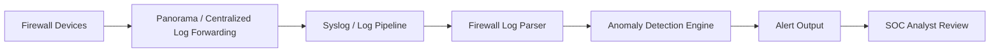
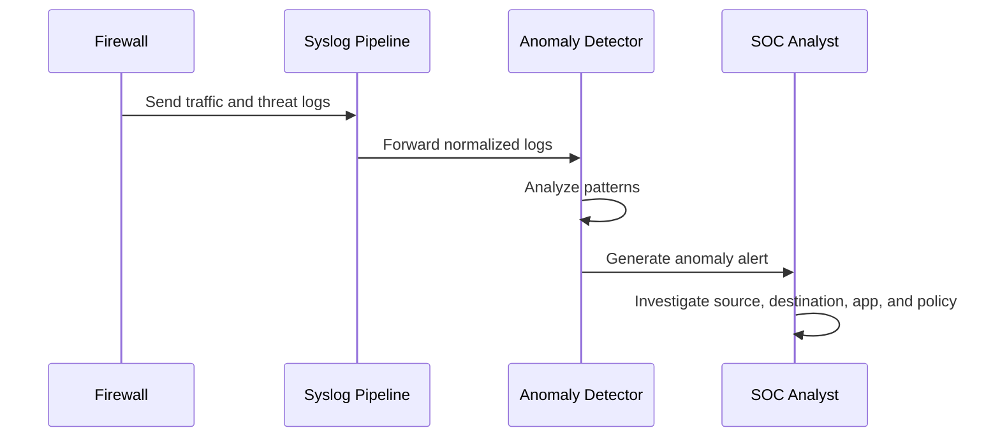

# Firewall Log Anomaly Detector

## Overview

This project detects anomalies in firewall traffic and threat logs. It is inspired by enterprise firewall operations involving Palo Alto Panorama, centralized logging, Zero Trust segmentation, SSL decryption visibility, and SOC monitoring workflows.

The detector reviews firewall log activity and identifies suspicious behavior such as unusual source IP activity, denied traffic spikes, abnormal destination patterns, risky application usage, and potential policy violations.

## Why This Project Matters

Enterprise security teams rely on centralized firewall logs to detect threats, investigate incidents, and validate policy enforcement. This project simulates that workflow by analyzing firewall logs and flagging unusual activity for security review.

## Skills Demonstrated

- Firewall log analysis
- Zero Trust security monitoring
- Network segmentation visibility
- Threat detection logic
- SOC-style alerting
- Python scripting
- Security analytics
- GitHub documentation
- Architecture diagramming

## Architecture



## Detection Logic

The project can detect:

- High volume of denied traffic from one source
- Repeated access attempts to restricted zones
- Suspicious traffic outside normal business hours
- Unusual destination ports
- High-risk application activity
- Potential command-and-control behavior
- Unexpected traffic between segmented zones

## Example Workflow



## Sample Alert

```text
ALERT: Unusual denied traffic spike detected
Source IP: 10.10.25.44
Destination Zone: DMZ
Action: deny
Reason: Source exceeded normal denied-traffic threshold
Severity: Medium
```

## How To Run

Install dependencies:

```bash
pip install -r requirements.txt
```

Run the detector:

```bash
python src/anomaly_detector.py
```

## Future Improvements

- Add machine learning-based anomaly detection
- Integrate with SIEM tools
- Add dashboard visualizations
- Support Palo Alto traffic, threat, URL, and WildFire logs
- Add MITRE ATT&CK mapping
- Add risk scoring by source IP, application, and zone

## Resume Bullet

Built a firewall log anomaly detector that analyzes centralized firewall logs to identify suspicious network behavior, denied traffic spikes, risky application usage, and potential policy violations in support of SOC monitoring and Zero Trust enforcement.

## Machine Learning Upgrade

This project uses Isolation Forest, an unsupervised machine learning algorithm, to detect unusual firewall log activity without requiring labeled attack data.

The model reviews features such as:

- Destination port
- Traffic volume in bytes
- Allow or deny action
- Unknown application usage
- Risky destination ports
- Restricted zone access

## IP Risk Scoring

Each source IP receives a risk score based on suspicious behavior:

- Denied traffic count
- Risky ports such as 3389, 445, 4444, and 23
- Unknown application usage
- Restricted zone access attempts

Severity levels:

- Low
- Medium
- High
- Critical

## Mini SIEM Dashboard

The project includes a Streamlit dashboard that displays:

- Total firewall logs
- Machine learning anomalies
- Denied sessions
- Critical source IPs
- Top risky IPs
- Anomaly event table
- Traffic breakdown by action and destination zone

## Run the Dashboard

```bash
streamlit run dashboard/app.py

## Panorama Syslog Log Server Lab

This project includes a realistic lab guide showing how a Linux rsyslog server could receive logs from Palo Alto Panorama.

The lab covers:

- Building a Linux syslog receiver
- Opening UDP 514
- Creating a Panorama Syslog Server Profile
- Creating a Log Forwarding Profile
- Sending Traffic, Threat, URL, WildFire, System, and Config logs
- Verifying logs with `tail` and `tcpdump`
- Using normalized CSV logs for ML anomaly detection

See:

```text
docs/panorama_syslog_lab.md
