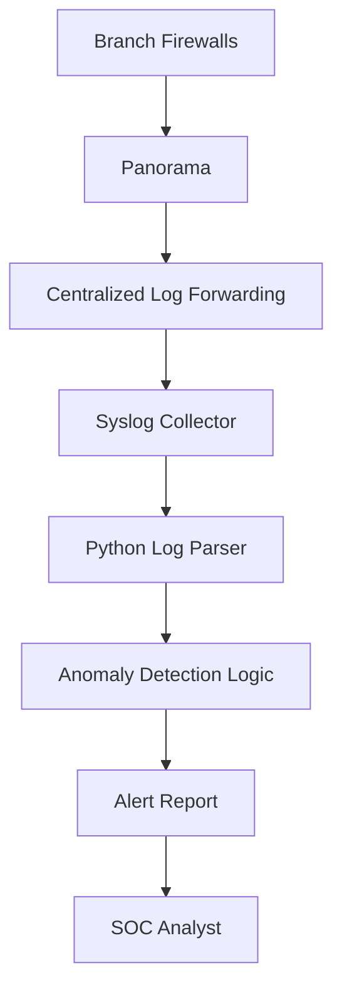

# Architecture Diagram

```mermaid
flowchart TD
    A[Branch Firewalls] --> B[Panorama]
    B --> C[Centralized Log Forwarding]
    C --> D[Syslog Collector]
    D --> E[Python Log Parser]
    E --> F[Anomaly Detection Logic]
    F --> G[Alert Report]
    G --> H[SOC Analyst]
```
