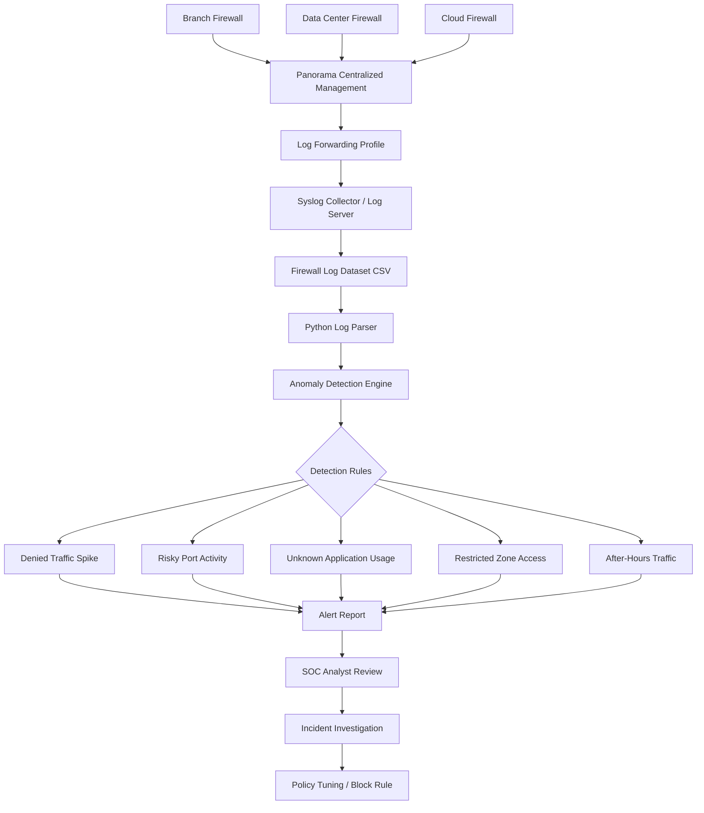

# Firewall Log Anomaly Detector Architecture

## Real-World Architecture

## Explanation

This architecture simulates an enterprise firewall logging environment.

Firewalls from branch, data center, and cloud environments send logs to Panorama. Panorama forwards traffic and threat logs using a log forwarding profile. The logs are collected by a syslog server or log pipeline and exported into a CSV dataset.

The Python anomaly detector parses the logs, checks for suspicious activity, and generates alerts for SOC analyst review.

## Project Flow

1. Firewall traffic is generated.
2. Logs are centralized through Panorama.
3. Logs are forwarded to a syslog/logging server.
4. Logs are exported into CSV format.
5. Python script analyzes the logs.
6. Suspicious behavior is flagged.
7. SOC analyst reviews the alert.
8. Firewall policy can be tuned based on findings.

## Security Use Cases

- Detect brute-force behavior
- Identify denied traffic spikes
- Monitor restricted zone access
- Detect risky ports such as 3389, 445, and 4444
- Find unknown application traffic
- Support SOC monitoring and Zero Trust validation
